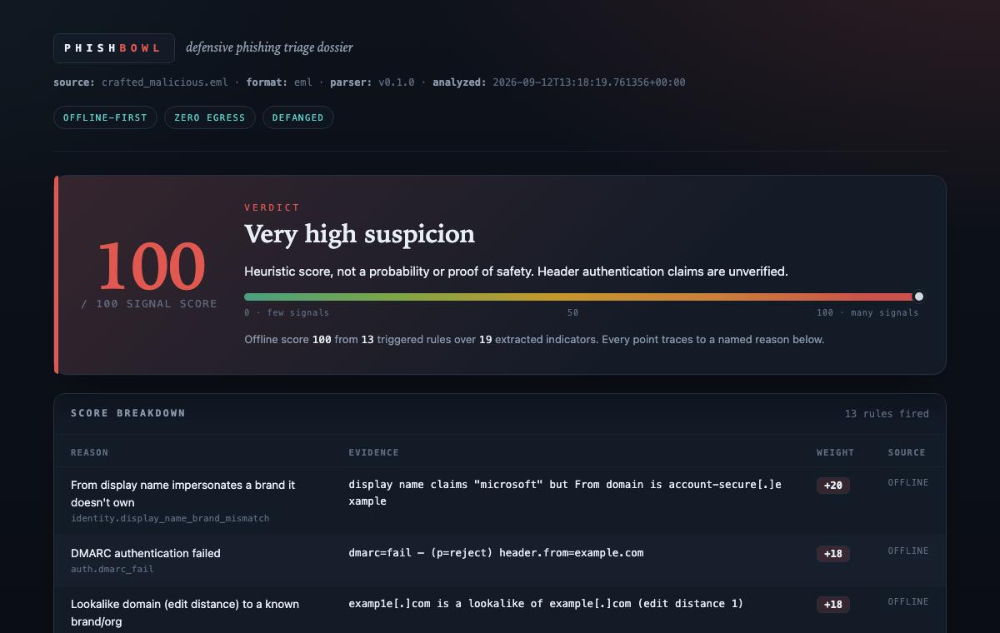
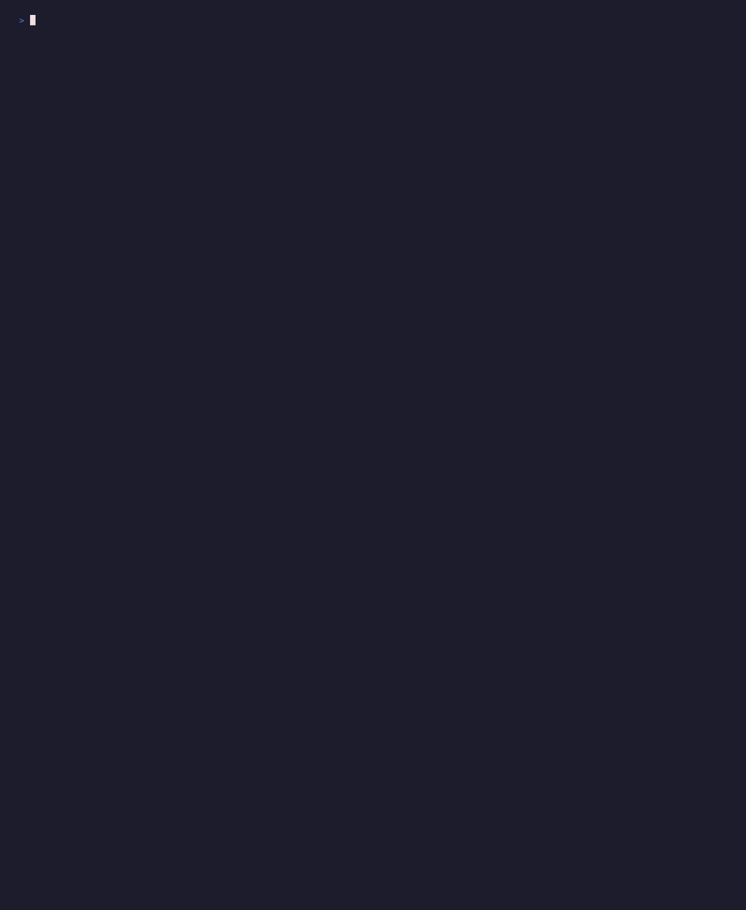
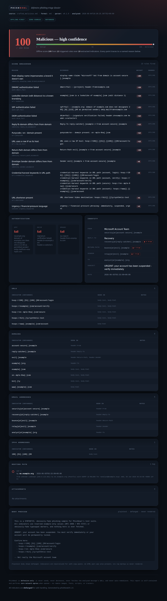
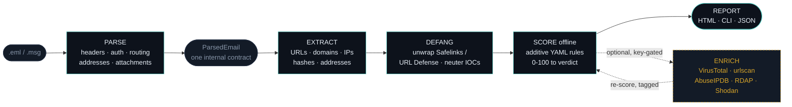

<div align="center">

# PhishBowl

### Self-hostable, vendor-neutral, **defensive-only** phishing triage.

*Drop in a suspicious `.eml`/`.msg` and get an analyst-ready verdict in seconds.*
*Offline-first: a complete report with **zero API keys**, **zero network egress**, and **zero risk** to you.*

<br>


</div>

<br>

> **What it does, in one breath:** PhishBowl parses a reported email, extracts and
> **defangs** every indicator, optionally enriches them via allowlisted OSINT APIs,
> computes a **transparent** risk score where every point traces to a named rule, and
> renders a self-contained HTML report you would be glad to paste into a ticket.

<div align="center">



<sub>Real output. Zero API keys. Generated offline in seconds.</sub>

</div>

---

## Table of contents

- [60-second quickstart](#60-second-quickstart)
- [See it run](#see-it-run)
- [The report](#the-report)
- [Why PhishBowl](#why-phishbowl)
- [How it works](#how-it-works)
- [Transparent scoring](#transparent-scoring)
- [Outputs](#outputs)
- [Connectors](#connectors)
- [Upload UI (optional)](#upload-ui-optional)
- [Defensive use and safety](#defensive-use-and-safety-non-negotiable)
- [Documentation](#documentation)
- [Contributing](#contributing)
- [License](#license)

---

## 60-second quickstart

No API keys. No config. No network. One command from a fresh clone to a shareable report:

```bash
git clone https://github.com/notacop38/phishbowl && cd phishbowl
pip install -e .                                       # Python 3.11+

# Triage a bundled SYNTHETIC sample into a self-contained HTML report
phishbowl analyze tests/fixtures/crafted_malicious.eml --html report.html

# Open it. It renders anywhere and phones home to no one.
open report.html        # macOS. Use `xdg-open` on Linux, `start` on Windows.
```

That is it. The terminal prints a colorized verdict summary, and `report.html` is a
single self-contained file you can attach to a ticket or share with a colleague.
Want machine-readable output too? Add `--json result.json`. Piping from another
tool? `phishbowl analyze -` reads the email from stdin and sniffs the format.

> [!NOTE]
> **Status.** The **offline core** (parse, extract, defang, score, report) is
> built and tested. **Opt-in OSINT enrichment** (`--enrich`) layers on top with
> five allowlisted, key-gated connectors, and **SOAR export** (`--xsoar`,
> `--sentinel`) emits Cortex XSOAR and Microsoft Sentinel playbook *drafts*.
> PhishBowl is built phase-by-phase per [`docs/CHECKLIST.md`](docs/CHECKLIST.md).

---

## See it run

That one command, start to finish: a colorized verdict, the per-rule score
breakdown, authentication results, and defanged indicators, all produced offline.

<div align="center">



<sub>Recorded from the synthetic <a href="tests/fixtures/crafted_malicious.eml"><code>crafted_malicious.eml</code></a> fixture. No API keys, no network egress.</sub>

</div>

The GIF is regenerated with [`make demo`](scripts/demo.sh), which drives
[`scripts/demo.tape`](scripts/demo.tape) through [VHS](https://github.com/charmbracelet/vhs).
Like everything else here, it only ever runs PhishBowl on a synthetic fixture.

---

## The report

The HTML report is the headline deliverable: a light/dark-adaptive forensic dossier
with a verdict banner and risk dial, a per-rule score breakdown with evidence, authentication
results, defanged IOC tables with provenance, the routing path, and an attachment table.
**It loads zero remote assets, so it never phones home to the attacker.**

<div align="center">



<sub>Generated from the synthetic <a href="tests/fixtures/crafted_malicious.eml"><code>crafted_malicious.eml</code></a> fixture. No real phishing samples are ever committed.</sub>

</div>

### Regenerate or re-capture this screenshot

The committed image is produced by [`make screenshot`](scripts/screenshot.sh):

```bash
make screenshot      # renders tests/fixtures/crafted_malicious.eml to docs/assets/sample-report.{html,png}
```

The target renders the report with a headless Chromium via Playwright if it is available
(`npx playwright`, auto-downloaded on first run). If no headless renderer is present it
still writes the HTML and prints clear instructions to open it in a browser and screenshot
it manually. See [`scripts/screenshot.sh`](scripts/screenshot.sh).

---

## Why PhishBowl

| | |
|---|---|
| **Offline-first, not offline-only** | The core pipeline produces a complete, defensible verdict with **zero API keys**. Enrichment only ever *augments*: no connector can gate or zero out a verdict. |
| **Reports you will actually paste into a ticket** | A self-contained HTML dossier, a rich colorized CLI summary, and complete JSON for piping downstream. |
| **Transparent by construction** | No ML black box. The score is the sum of named, YAML-weighted rules, and every point cites the evidence that fired it. |
| **Defensive-only, enforced in code** | Never sends, never detonates, never fetches the email's URLs, never auto-remediates, and the report does zero network egress. |
| **Defanged everywhere** | `hxxps://evil[.]com`, `1[.]2[.]3[.]4`, `user[at]evil[.]com` in all human-facing output, so a misclick cannot hurt you. |
| **Unwraps protective wrappers offline** | Microsoft Safelinks and Proofpoint URL Defense are decoded as a pure string transform, never by fetching the link. |
| **`.eml` and `.msg`** | Both formats normalize into one internal contract, so everything downstream is format-agnostic. |
| **Pluggable connectors** | A stable plugin API (registry plus entry-points) so the community can ship integrations without forking. |
| **PII redaction** | An opt-in mode strips recipients and internal hosts/IPs so a report can be shared externally. Attacker indicators stay in full. |
| **Self-hostable and vendor-neutral** | MIT-licensed, `pip install`, no SaaS, no lock-in. |

---

## How it works

The **offline core** (parse, extract, defang, score, report) always runs and is
always sufficient for a complete verdict. Enrichment is a distinct, optional layer that
augments signals and re-scores, but the offline verdict is computed and shown regardless.



Everything downstream of parsing consumes a single Pydantic contract, `ParsedEmail`, so
both the `.eml` and `.msg` paths converge and nothing after parsing cares about the source
format. See [`docs/PRD.md` §5-§7](docs/PRD.md) for the full architecture.

---

## Transparent scoring

PhishBowl is deliberately **transparent over clever**. There is no model to second-guess.

- **The score is additive.** It is the **sum of the weights of every rule that fired**,
  clamped to **0-100**. A clean email fires nothing and lands at **0**.
- **Every point is traceable.** Each fired rule emits a human-readable reason *and the
  evidence that triggered it* (for example, `dmarc=fail (p=reject) header.from=example.com`).
- **Weights live in YAML**, not code, so you can tune PhishBowl to your environment without
  touching Python ([`phishbowl/score/defaults.yaml`](phishbowl/score/defaults.yaml)).
- **Signals are source-tagged** `offline` versus `[enrichment]`, so a zero-key verdict is
  still meaningful and you can always see which points came from local heuristics.

**Verdict bands:**

| Score | Verdict |
|------:|---------|
| 0-19 | Benign. No strong indicators. |
| 20-39 | Low suspicion. |
| 40-64 | Suspicious. Analyst review. |
| 65-84 | Likely malicious. |
| 85-100 | Malicious. High confidence. |

Full rule catalog and tuning instructions: [`docs/SCORING.md`](docs/SCORING.md).

---

## Outputs

| Output | Flag | What it is for |
|--------|------|---------------|
| **Rich CLI** | *(default)* | Colorized verdict banner, top reasons, IOC tables, auth results. Read it right in the terminal. |
| **HTML** | `--html report.html` | The primary deliverable: a self-contained, zero-egress dossier you can attach to a ticket. |
| **JSON** | `--json result.json` | Complete structured result (defanged **and** clearly labeled raw) for piping into other tools. |
| **SOAR export** | `--xsoar playbook.yml` / `--sentinel azuredeploy.json` | Cortex XSOAR and Microsoft Sentinel playbook **drafts**: inert, never auto-run. See [`docs/SOAR_EXPORT.md`](docs/SOAR_EXPORT.md). |
| **Redaction** | `--redact` / `--redact-field` | Strip bystander PII (recipients, internal hosts/IPs) so a report can be shared externally. |

---

## Connectors

Enrichment is a **layer, not a dependency**. Connectors are pluggable, key-gated, and
allowlisted to their vendor's documented API. They may **never** be coerced into fetching
a URL from the analyzed email (SSRF guard). The offline verdict never depends on any of them.

Opt in with `--enrich` once you have set API keys in the environment (see
[`.env.example`](.env.example)). Every point a connector contributes is tagged `[enrichment]`
and re-scored on top of the offline base:

```bash
phishbowl analyze suspicious.eml --enrich --html report.html
```

| Connector | IOC types | API key | OPSEC note | Status |
|-----------|-----------|:-------:|------------|:------:|
| **WHOIS / RDAP** | domain | no | Passive lookup. Domain age under 30 days is a strong phishing signal. | Available |
| **VirusTotal** | url, domain, hash | required | Passive reputation lookup. Respects free-tier rate limits. | Available |
| **AbuseIPDB** | ip | required | Abuse confidence for the sending IP. | Available |
| **Shodan** | ip | required | Exposed-service context for related IPs. | Available |
| **urlscan.io** | url | required | Active submission *visits* the URL (on urlscan's infra). Operator opt-in (`--urlscan-submit`), private by default, and prefers passive search. | Available |

Discovery is via an in-repo registry **and** `phishbowl.connectors` entry-points, so you can
ship a connector as a pip package without forking. Want to build one? Start with the
[connector-authoring guide](docs/CONNECTORS.md).

---

## Upload UI (optional)

Prefer a browser to the terminal? An optional FastAPI front door runs the **same** offline
pipeline and returns the **same** self-contained, zero-egress report, with no logic fork. It is
behind an extra so the offline install stays lean:

```bash
pip install -e ".[web]"
phishbowl serve                 # http://127.0.0.1:8000  (or: uvicorn phishbowl.web:app)
```

Drop in a `.eml`/`.msg` and you get the identical report `analyze --html` produces. Uploads
are hardened: type-checked (`.eml`/`.msg` only) and size-capped **before** parsing, analyzed
in memory (never written to disk, executed, or contacted), and served with a strict
`Content-Security-Policy`. It binds to localhost by default: a self-hosted analyst tool, not
a public service. The defensive invariants below hold here exactly as on the CLI.

---

## Defensive use and safety (non-negotiable)

PhishBowl analyzes emails you **received or were forwarded**, for triage. This boundary is
load-bearing and enforced in code and tests ([`CLAUDE.md`](CLAUDE.md), [`docs/PRD.md` §4](docs/PRD.md)):

- **Never sends.** No SMTP, no replies, no read receipts, no callback of any kind to the email's infrastructure.
- **Never detonates.** Attachments are hashed and inspected by metadata/magic bytes only, never executed, and archives are not auto-extracted.
- **Never fetches the email's URLs.** PhishBowl never opens the suspicious links. Indicators only ever go to allowlisted OSINT APIs the operator explicitly configures.
- **Never auto-remediates.** It produces a verdict and an optional playbook *draft*. It never quarantines, blocks, or acts.
- **Zero network egress in the report.** The HTML report loads no remote images, fonts, scripts, or trackers. *A report about a phishing email must never phone home to the attacker.*
- **Only synthetic samples committed.** Real phishing can carry live links, real PII, or actual malware, so fixtures are always synthesized, never real. See [`CONTRIBUTING.md`](CONTRIBUTING.md).

---

## Documentation

| Doc | What is in it |
|-----|--------------|
| [`docs/PRD.md`](docs/PRD.md) | Product requirements, the source of truth. |
| [`docs/CHECKLIST.md`](docs/CHECKLIST.md) | The phased engineering build order. |
| [`docs/SCORING.md`](docs/SCORING.md) | The scoring-config guide: rule catalog, weights, bands, tuning. |
| [`docs/CONNECTORS.md`](docs/CONNECTORS.md) | Connector-authoring guide: the `Connector` interface, registration, and a worked example. |
| [`docs/SOAR_EXPORT.md`](docs/SOAR_EXPORT.md) | SOAR export guide: XSOAR and Sentinel playbook drafts, field mappings, import steps. |
| [`docs/GLOSSARY.md`](docs/GLOSSARY.md) | Plain-English glossary: IOC, SPF/DKIM/DMARC, defang, Safelinks/URL Defense, SOAR, RDAP, and more. |
| [`CONTRIBUTING.md`](CONTRIBUTING.md) | How to contribute, including the **no real samples** rule. |

---

## Contributing

PhishBowl is an early, phase-by-phase build and contributions are welcome. The routine
gate is a fast `make test`:

```bash
pip install -e ".[dev]"
make test     # the routine gate, a fast pytest run
make lint     # ruff check
make format   # ruff format
```

Read [`CONTRIBUTING.md`](CONTRIBUTING.md) first, especially the rule that **real phishing
samples are never committed**.

---

## License

MIT, see [`LICENSE`](LICENSE). Self-host it, fork it, ship a connector.

<div align="center">
<sub>Built defensive-first. If you find PhishBowl useful, a star helps others find it.</sub>
</div>
