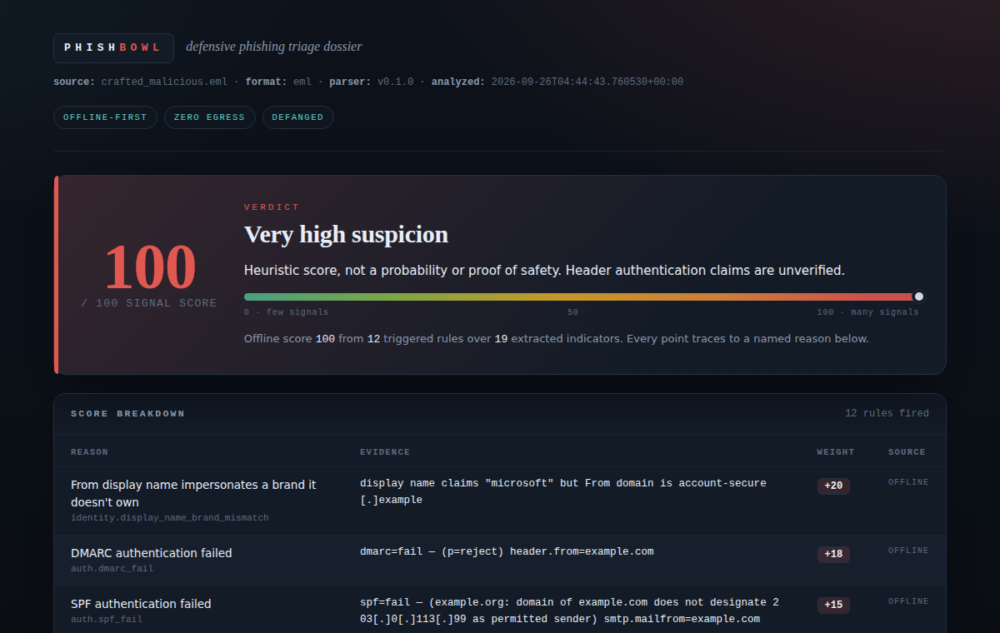
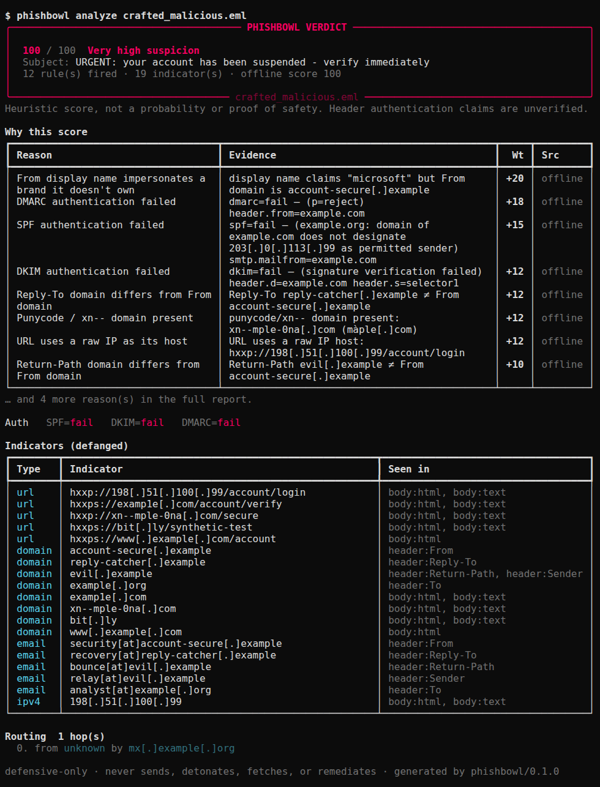
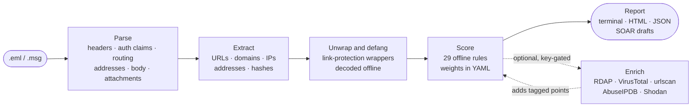

<div align="center">

# PhishBowl

**Offline, defensive-only triage for reported phishing emails.**

PhishBowl reads a suspicious `.eml` or `.msg`, extracts and defangs every indicator,
explains a transparent risk score one rule at a time, and writes a self-contained
report you can attach to a ticket. It needs no API keys and makes no network
requests unless you opt in to OSINT enrichment.

[](pyproject.toml)
[](LICENSE)

</div>



<p align="center"><sub>Generated offline from the synthetic
<a href="tests/fixtures/crafted_malicious.eml"><code>crafted_malicious.eml</code></a> fixture.</sub></p>

PhishBowl organizes evidence for an analyst. It is not a mail gateway, a sandbox, or a
classifier, and it does not verify SPF, DKIM, or DMARC itself: it reports what the
receiving servers recorded. Treat the score as a summary of named signals, not as the
probability that a message is malicious.

## Contents

- [Quick start](#quick-start)
- [What you get](#what-you-get)
- [How it works](#how-it-works)
- [Reading a verdict](#reading-a-verdict)
- [Command reference](#command-reference)
- [Scoring](#scoring)
- [Enrichment (optional)](#enrichment-optional)
- [Redaction](#redaction)
- [SOAR playbook drafts](#soar-playbook-drafts)
- [Upload UI (optional)](#upload-ui-optional)
- [Using PhishBowl from Python](#using-phishbowl-from-python)
- [Safety model](#safety-model)
- [Limits](#limits)
- [Development](#development)
- [Documentation](#documentation)
- [Security and license](#security-and-license)

## Quick start

PhishBowl requires Python 3.11 or newer and installs from source:

```bash
git clone https://github.com/NotACop38/PhishBowl.git
cd PhishBowl
python3 -m venv .venv && source .venv/bin/activate
pip install -e .

# Triage a bundled synthetic sample and write the HTML report.
phishbowl analyze tests/fixtures/crafted_malicious.eml --html report.html
```

The terminal shows the verdict, the strongest reasons, and the defanged indicators.
`report.html` is a single file with no external resources; open it in any browser.

A few common variations:

```bash
phishbowl analyze reported.msg --json result.json     # also write the JSON result
phishbowl analyze - < reported.eml                    # read stdin; the format is sniffed
phishbowl analyze forward.eml --inner                 # triage the attached email, not the forward
phishbowl analyze reported.eml --redact --html share.html   # withhold recipients and internal hosts
```

## What you get

| Output | Option | Contents |
|--------|--------|----------|
| Terminal summary | *(default)* | Verdict, score, top reasons with evidence, authentication results, defanged indicators, routing. `-q` suppresses it. |
| HTML report | `--html PATH` | The full report as one self-contained file: no scripts, no remote resources, and a Content-Security-Policy that forbids loading any. |
| JSON result | `--json PATH` or `--json -` | Everything in the report as structured data, for other tools. |
| SOAR drafts | `--xsoar PATH`, `--sentinel PATH` | Cortex XSOAR and Microsoft Sentinel playbooks that cannot run on their own. |

<div align="center">



</div>

The HTML report contains the verdict and score, the score breakdown with each rule's
evidence, the authentication header claims, the sender identity fields, every indicator
grouped by type with its provenance (where in the message it was found), the routing
path, the full ordered header set, attachment hashes and detected types, a plaintext
body preview, and analysis notes. It adapts to light and dark mode and prints cleanly.
The attacker's HTML is never rendered: the body preview is escaped, defanged text. See
the [complete sample report](docs/assets/sample-report.png).

Indicators are **defanged** wherever a person reads them (`hxxps://evil[.]example`,
`198[.]51[.]100[.]99`, `user[at]evil[.]example`), so copying from a report never produces
a live link. The JSON carries each indicator twice, as `value_display` (defanged) and
`value_raw` (usable by tools):

```json
{
  "type": "url",
  "value_display": "hxxp://198[.]51[.]100[.]99/account/login",
  "value_raw": "http://198.51.100.99/account/login",
  "provenance": ["body:html", "body:text"],
  "wrapper": null,
  "wrapped_display": null,
  "unresolved": false,
  "redacted": false
}
```

## How it works


```mermaid
flowchart LR
    IN([".eml / .msg"]) --> P["Parse<br/>headers · auth claims · routing<br/>addresses · body · attachments"]
    P --> X["Extract<br/>URLs · domains · IPs<br/>addresses · hashes"]
    X --> D["Unwrap and defang<br/>link-protection wrappers<br/>decoded offline"]
    D --> S["Score<br/>29 offline rules<br/>weights in YAML"]
    S --> R(["Report<br/>terminal · HTML · JSON<br/>SOAR drafts"])
    S -.->|optional, key-gated| E["Enrich<br/>RDAP · VirusTotal · urlscan<br/>AbuseIPDB · Shodan"]
    E -.->|adds tagged points| S
```

1. **Parse.** `.eml` files are parsed with the standard library under explicit size,
   depth, and line budgets; `.msg` files with `extract-msg`. Both become one internal
   model, `ParsedEmail`, so every later stage is format-agnostic. Headers keep their
   order and duplicates. RFC 2047 encoded-words are decoded only where the RFCs allow
   them (the subject and other free-text headers, and display names), so an encoded
   header cannot smuggle in a forged result. `Authentication-Results` are read only
   from the topmost receiving server, since lower headers arrive with the message and
   can be forged. Attachments are hashed (MD5, SHA-1, SHA-256) and typed by their magic
   bytes; nothing is executed or extracted.
2. **Extract.** Indicators are collected from the address headers, the subject, the
   plaintext body, the visible and hidden text of the HTML body, HTML link and resource
   attributes (including `srcset`, CSS `url()`, and meta refresh), other inline text
   parts such as calendar invites, and attachment hashes. Each indicator records every
   place it was seen.
3. **Unwrap and defang.** Microsoft Safe Links, Proofpoint URL Defense (v1–v3), Barracuda,
   and Cisco wrappers are decoded as pure string transformations. Mimecast links cannot
   be reversed offline, so they are kept wrapped, marked unresolved, and their target
   domain is recorded when the link names it. Both the wrapped and the unwrapped forms
   are kept.
4. **Score.** Offline rules inspect authentication claims, sender identity, links,
   attachments, and wording. Each rule that fires adds its weight once and records the
   evidence that triggered it.
5. **Report.** One prepared view feeds every output, so defanging, redaction, and
   severity are identical in the terminal, HTML, JSON, and SOAR drafts.

Enrichment is a separate, optional layer: it only adds points, tagged `[enrichment]`,
on top of an offline score that is always computed and shown on its own.

## Reading a verdict

The score is the sum of the weights of the rules that fired, clamped to 0–100. Each
score falls in one band, which sets the verdict text and a stable severity name:

| Score | Verdict (default wording) | Severity |
|------:|---------------------------|----------|
| 0–19 | Few signals — safety undetermined | `minimal` |
| 20–39 | Low suspicion | `low` |
| 40–64 | Suspicious — analyst review | `elevated` |
| 65–84 | High suspicion | `high` |
| 85–100 | Very high suspicion | `critical` |

The verdict wording and band limits are configurable; the severity names are fixed, so
automation can rely on them. A low score means few configured signals fired, not that
the message is safe.

**Incomplete analysis.** When part of a message could not be analyzed (a malformed MIME
structure, a part that failed to parse, or content beyond an analysis budget), the
verdict ends in `(incomplete analysis)`, `analysis_complete` is `false` in the JSON, and
each gap is listed under *Not analyzed*. The score is then a lower bound. Informational
notes, such as an Outlook item that carries no transport headers, are listed separately
and do not make an analysis incomplete.

**Exit status.** `phishbowl analyze` writes every requested output before it exits:

| Status | Meaning |
|-------:|---------|
| `0` | Analysis complete, and the score is below any `--fail-on` threshold. |
| `1` | The score reached the `--fail-on` threshold. This takes precedence over `3`: an incomplete score is a lower bound, so reaching the threshold is still conclusive. |
| `2` | Invalid usage, unreadable input, or an output that could not be written. |
| `3` | Analysis incomplete (see above). |

`--fail-on` takes a severity (`low`, `elevated`, `high`, `critical`) or a score from 0 to
100, which makes PhishBowl usable as a gate in scripts and SOAR workflows:

```bash
phishbowl analyze reported.eml -q --json result.json --fail-on high
```

## Command reference

`phishbowl analyze PATH [OPTIONS]` triages one message. `PATH` is a `.eml` or `.msg`
file, or `-` to read from standard input.

| Option | Effect |
|--------|--------|
| `--html PATH`, `-H PATH` | Write the self-contained HTML report. |
| `--json PATH`, `-j PATH` | Write the JSON result; `-` writes it to standard output and suppresses the terminal summary. |
| `--xsoar PATH` | Write a Cortex XSOAR playbook draft (YAML). |
| `--sentinel PATH` | Write a Microsoft Sentinel playbook draft (ARM template, JSON). |
| `--redact` | Withhold recipients, internal hosts, and internal IP addresses from every output. |
| `--redact-field NAME` | Also withhold the named header and everything parsed from it. Repeatable; implies `--redact`. |
| `--inner` | Triage the email attached to the input (a forwarded `message/rfc822`, `.eml`, or Outlook item) instead of the input itself. |
| `--inner-index N` | Choose which attached email to triage (0-based, default 0). Implies `--inner`. |
| `--scoring-config PATH` | Layer a YAML scoring override over the bundled defaults. |
| `--enrich` | Query the configured OSINT connectors (see [Enrichment](#enrichment-optional)). |
| `--connector NAME` | Run only this connector. Repeatable; implies `--enrich`. |
| `--disable-connector NAME` | Skip this connector. Repeatable; implies `--enrich`. |
| `--urlscan-submit` | Allow urlscan.io to scan the message's URLs (private scans). Implies `--enrich`. |
| `--fail-on LEVEL` | Exit with status 1 when the score reaches a severity or a 0–100 score. |
| `--quiet`, `-q` | Print no summary or status messages. Outputs are still written and errors still reported. |

Outputs may not overwrite the input message (including when it arrives on standard input
from a file), the scoring configuration, or each other, and their directories must exist;
these checks run before any analysis.

`phishbowl serve [--host HOST] [--port PORT]` starts the optional upload UI, and
`phishbowl --version` prints the installed version.

## Scoring

The score is transparent by construction: there is no model, only named rules with
weights you can read and change. The bundled rules, by family:

| Family | Rules | Examples |
|--------|------:|----------|
| Authentication claims | 6 | `auth.dmarc_fail` (18), `auth.spf_fail` (15), `auth.dkim_fail` (12) |
| Sender identity | 7 | `identity.display_name_brand_mismatch` (20), `identity.multiple_from` (20), `identity.freemail_role` (12) |
| Links and domains | 8 | `url.idn_homograph` (18), `url.lookalike` (18), `url.anchor_href_mismatch` (16) |
| Attachments | 7 | `attach.double_extension` (22), `attach.executable` (22), `attach.html` (14) |
| Content | 1 | `content.urgency_keywords` (4, deliberately weak) |

Each rule counts once however many indicators trigger it, and related rules do not
double-count the same fact (a homograph domain is scored as a homograph, not also as
punycode). Weights, verdict bands, and the supporting lists (freemail providers, URL
shorteners, credential and urgency phrases, organizational roles, impersonated brands,
and your own `org_domains`) live in
[`phishbowl/score/defaults.yaml`](phishbowl/score/defaults.yaml). Override only what you
need:

```yaml
# site-scoring.yaml
org_domains: [acme-corp.example]   # catch lookalikes of your own domains
weights:
  content.urgency_keywords: 0      # still reported, adds no points
```

```bash
phishbowl analyze reported.eml --scoring-config site-scoring.yaml
# or: export PHISHBOWL_SCORING_CONFIG=site-scoring.yaml
```

Configuration is validated strictly: an unknown key, an unknown rule ID (reported with
the closest valid one), a weight that is not a number from 0 to 100, or a malformed band
is an error rather than a silent change to verdicts. The weights are hand-set
heuristics, checked against the synthetic fixtures, not calibrated against real mail.
The full rule catalog and tuning guidance are in [`docs/SCORING.md`](docs/SCORING.md).

## Enrichment (optional)

With `--enrich`, PhishBowl sends selected indicators to OSINT services and adds their
findings as tagged points on top of the offline score. Connectors that need a key are
skipped, with a note, until the key is set in the environment
(see [`.env.example`](.env.example)).

| Connector | Looks up | Key (environment variable) | Contributes |
|-----------|----------|----------------------------|-------------|
| RDAP | Registered domains | none | Domain registered fewer than 30 days ago (18) |
| VirusTotal | URLs, domains, file hashes | `VIRUSTOTAL_API_KEY` | Up to 45, scaled by the share of engines that flagged it |
| urlscan.io | URLs, searched by domain | `URLSCAN_API_KEY` | A prior scan judged malicious (20; 10 when the scan was of another page on the host) |
| AbuseIPDB | IP addresses | `ABUSEIPDB_API_KEY` | Up to 25, scaled by abuse confidence (fires at 25% or more) |
| Shodan | IP addresses | `SHODAN_API_KEY` | Exposed remote-access, file-sharing, or database services (up to 6) |

What leaves the machine, and what never does:

- Each connector can reach only its vendor's API hosts, over HTTPS. The allowlist is
  checked before every request and every redirect, so no connector can be made to fetch
  a URL from the analyzed message.
- Non-public IP addresses (private, loopback, link-local, reserved) in any notation,
  local host names, hosts under your `org_domains`, domains seen only in recipient
  headers, and email addresses are never sent, whether as indicators or as the host of
  a URL. A URL that passes is sent whole to VirusTotal, so its path and query go with
  it.
- urlscan.io searches by host name by default and never submits a URL unless you pass
  `--urlscan-submit`. A submission makes urlscan visit the URL, which can alert the
  attacker and can leak a per-victim token in the URL; submissions are private, but
  private only hides the result page.
- API keys are read from the environment only and are scrubbed from outputs, logs, and
  the cache.

Results are cached on disk, private to the current user, in `$PHISHBOWL_CACHE_DIR` or
else `~/.cache/phishbowl/enrichment` (honoring `$XDG_CACHE_HOME`). Requests are
rate-limited, and each connector queries a bounded number of indicators per run; the
report says when that limit left indicators unqueried. A missing key, a network error,
or a malformed vendor response affects only that connector and is reported; it never
stops the run or changes the offline score. To write your own connector, see
[`docs/CONNECTORS.md`](docs/CONNECTORS.md).

## Redaction

Reports travel into tickets and vendor submissions. `--redact` withholds bystander data
in every output while keeping the attacker's indicators:

- **Recipients:** every address the message was delivered to (`To`, `Cc`, `Bcc`,
  `Delivered-To`, `X-Original-To`, `Resent-*`, similar delivery headers, and
  `Received … for <address>` clauses), with their display names and non-freemail
  domains.
- **Internal topology:** hosts under your configured `org_domains` and non-public IP
  addresses.
- **Named fields:** each `--redact-field` header, with everything derived from it; hiding
  `Authentication-Results` also hides the parsed results and the evidence quoting them,
  and hiding `Received` hides the routing path.

Values are replaced in place by typed placeholders such as `[redacted:recipient]`, so the
report still shows that something was there. Matching works on whole tokens and sees
through defanging and URL encoding; when a protected value survives only inside
percent-encoding, the whole value is withheld. Redaction removes the values it knows
about. It is not anonymization: free text can still identify people, so review a report
before sharing it.

## SOAR playbook drafts

`--xsoar` and `--sentinel` export the triage as a starting point for your own response
playbook. The XSOAR draft contains only manual tasks, and the Sentinel draft deploys
disabled, behind a manual trigger, with inert `Compose` actions. Both properties are
enforced by bundled JSON Schemas that the test suite validates on every fixture.
Indicators appear raw in the machine fields a SOAR pivots on and defanged everywhere a
person reads. Import steps and field mappings are in
[`docs/SOAR_EXPORT.md`](docs/SOAR_EXPORT.md).

## Upload UI (optional)

A small FastAPI app runs the same pipeline behind a browser upload form and returns the
same HTML report:

```bash
pip install -e ".[web]"
phishbowl serve            # http://127.0.0.1:8000
```

Uploads are type-checked and size-limited before parsing and are analyzed in memory, one
at a time. Every response carries a strict Content-Security-Policy and anti-framing
headers. The app has no authentication and binds to loopback by default; `serve` warns
when bound elsewhere. Treat it as a single-analyst tool, not a shared service.

## Using PhishBowl from Python

```python
from phishbowl.parse import parse
from phishbowl.pipeline import triage
from phishbowl.report import render_html

view, result = triage(parse("reported.eml"))
print(result.score, result.verdict, result.analysis_complete)
for rule in view.fired_rules:  # the report view: defanged, ready to display
    print(f"+{rule.weight:g}  {rule.id}  {'; '.join(rule.evidence)}")

with open("report.html", "w", encoding="utf-8") as fh:
    fh.write(render_html(view))
```

`triage` returns the prepared report view (defanged, and redacted when a policy is
given) and the raw `ScoreResult`. It also accepts a scoring configuration and
enrichment settings; the CLI and the upload UI both call it.

## Safety model

The message under analysis is hostile input from end to end. These guarantees are
enforced in code and covered by the test suite:

- **Never sends.** No SMTP, no replies, no read receipts, no callback of any kind to the
  message's infrastructure.
- **Never detonates.** Attachments are hashed and inspected by metadata and magic bytes
  only; they are never executed, and archives are never extracted.
- **Never fetches the message's URLs.** Indicators go only to the allowlisted services
  an operator enables.
- **Never remediates.** PhishBowl produces a verdict and optional playbook drafts; it
  never quarantines, blocks, or acts.
- **Reports make no network requests.** The HTML report loads no remote images, fonts,
  scripts, or styles, so opening it cannot notify the attacker.
- **Only synthetic samples in the repository.** Real phishing can carry live links,
  personal data, or malware, so every fixture is synthesized.

`tests/test_safety_invariants.py` runs every fixture through the pipeline with a guard
that fails the test on any outbound connection or SMTP use, and checks that reports
contain no executable or remotely loaded markup and no seeded secret values.

## Limits

PhishBowl bounds its own work so that a hostile message cannot exhaust it:

| Budget | Limit |
|--------|-------|
| Input size | 50 MiB |
| MIME structure | 2,000 parts, nesting depth 30, 1,000,000 lines of at most 64 KiB |
| Text analyzed per body representation | 262,144 characters |
| Indicators per message | 1,000, with a 150 ms budget per extraction pattern |
| Link unwrapping | 5 nested wrappers, 16 KiB per wrapped URL |

Input over 50 MiB is refused. A message that exceeds any other budget is still
reported, with its verdict marked incomplete; one over the MIME budget is analyzed from
its headers alone. These are application budgets, not an operating-system sandbox; see
[`SECURITY.md`](SECURITY.md) for the full threat model.

## Development

```bash
pip install -e ".[dev]"
make test       # the pytest suite: the routine gate
make lint       # ruff check
make format     # ruff format
make screenshot # regenerate docs/assets from the synthetic fixture (needs Playwright)
```

| Path | Contents |
|------|----------|
| `phishbowl/parse/` | `.eml` and `.msg` parsing into `ParsedEmail`, with input limits |
| `phishbowl/extract/` | Indicator extraction, unwrapping, and defanging |
| `phishbowl/score/` | Rule detectors, the scoring engine, and `defaults.yaml` |
| `phishbowl/report/` | The shared report view, redaction, and the terminal, HTML, and JSON renderers |
| `phishbowl/export/` | SOAR drafts and their JSON Schemas |
| `phishbowl/connectors/` | The enrichment framework and the bundled connectors |
| `phishbowl/web/` | The optional upload UI |
| `tests/` | The test suite and the synthetic fixtures |

Contributions are welcome; read [`CONTRIBUTING.md`](CONTRIBUTING.md) first, especially the
rule that real phishing samples are never committed.

## Documentation

| Document | Contents |
|----------|----------|
| [`docs/SCORING.md`](docs/SCORING.md) | Every rule, its weight and trigger, verdict bands, and tuning |
| [`docs/CONNECTORS.md`](docs/CONNECTORS.md) | Writing, registering, and testing an enrichment connector |
| [`docs/SOAR_EXPORT.md`](docs/SOAR_EXPORT.md) | XSOAR and Sentinel drafts: import steps, field mappings, safety |
| [`docs/GLOSSARY.md`](docs/GLOSSARY.md) | IOC, defanging, SPF/DKIM/DMARC, homographs, and other terms |
| [`docs/PRD.md`](docs/PRD.md) | The product requirements |
| [`docs/CHECKLIST.md`](docs/CHECKLIST.md) | The phased build plan |
| [`SECURITY.md`](SECURITY.md) | Threat model, limits, and vulnerability reporting |
| [`CHANGELOG.md`](CHANGELOG.md) | Release history |

## Security and license

Report vulnerabilities privately through GitHub Security Advisories, as described in
[`SECURITY.md`](SECURITY.md); never attach a real phishing sample. PhishBowl is released
under the [MIT License](LICENSE).
